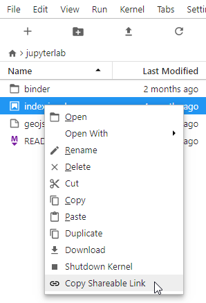

# Frequently asked questions

## How do I share links to notebooks?

Sharing links to notebooks is a common activity,
and can look different depending on what you mean by 'share.'
Your first instinct might be to copy the URL you see in the browser,
e.g. `jupyterhub.example/user/yourname/notebooks/coolthing.ipynb`,
but this usually won't work, depending on the permissions of the person you share the link with.

Unfortunately, 'share' means at least a few things to people in a JupyterHub context.
We'll cover 3 common cases here, when they are applicable, and what assumptions they make:

1. sharing links that will open the same file on the visitor's own server
2. sharing links that will bring the visitor to _your_ server (e.g. for real-time collaboration, or RTC)
3. publishing notebooks and sharing links that will download the notebook into the user's server

### link to the same file on the visitor's server

This is for the case where you have JupyterHub on a shared (or sufficiently similar) filesystem, where you want to share a link that will cause users to login and start their _own_ server, to view or edit the file.

**Assumption:** the same path on someone else's server is valid and points to the same file

This is useful in e.g. classes where you know students have certain files in certain locations, or collaborations where you know you have a shared filesystem where everyone has access to the same files.

A link should look like `https://jupyterhub.example/hub/user-redirect/lab/tree/foo.ipynb`.
You can hand-craft these URLs from the URL you are looking at, where you see `/user/name/lab/tree/foo.ipynb` use `/hub/user-redirect/lab/tree/foo.ipynb` (replace `/user/name/` with `/hub/user-redirect/`).
Or you can use JupyterLab's "copy shareable link" in the context menu in the file browser:

which will produce a correct URL with `/hub/user-redirect/` in it.

### link to the file on your server

This is for the case where you want to both be using _your_ server, e.g. for real-time collaboration (RTC).

**Assumption:** the user has (or should have) access to your server.

**Assumption:** your server is running _or_ the user has permission to start it.

By default, JupyterHub users don't have access to each other's servers, but JupyterHub 2.0 administrators can grant users limited access permissions to each other's servers.
If the visitor doesn't have access to the server, these links will result in a 403 Permission Denied error.

In many cases, for this situation you can copy the link in your URL bar (`/user/yourname/lab`), or you can add `/tree/path/to/specific/notebook.ipynb` to open a specific file.

The [jupyterlab-link-share] JupyterLab extension generates these links, and even can _grant_ other users access to your server.

[jupyterlab-link-share]: https://github.com/jupyterlab-contrib/jupyterlab-link-share

:::{warning}
Note that the way the extension _grants_ access is handing over credentials to allow the other user to **_BECOME YOU_**.
This is usually not appropriate in JupyterHub.
:::

### link to a published copy

Another way to 'share' notebooks is to publish copies, e.g. pushing the notebook to a git repository and sharing a download link.
This way is especially useful for course materials,
where no assumptions are necessary about the user's environment,
except for having one package installed.

**Assumption:** The [nbgitpuller](inv:nbgitpuller#index) server extension is installed

Unlike the other two methods, nbgitpuller doesn't provide an extension to copy a shareable link for the document you're currently looking at,
but it does provide a [link generator](inv:nbgitpuller#link),
which uses the `user-redirect` approach above.

When visiting an nbgitpuller link:

- The visitor will be directed to their own server
- Your repo will be cloned (or updated if it's already been cloned)
- and then the file opened when it's ready

[nbgitpuller]: https://nbgitpuller.readthedocs.io
[nbgitpuller-link]: https://nbgitpuller.readthedocs.io/en/latest/link.html
